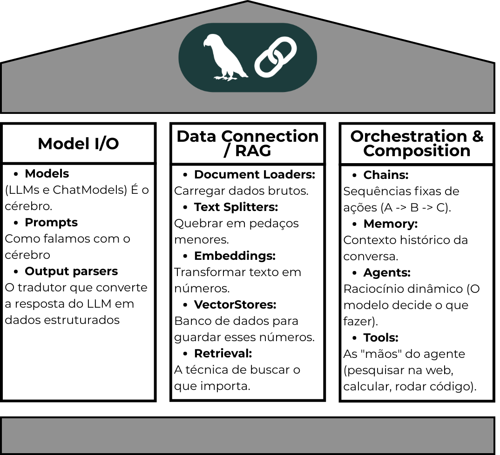

# 🦜🔗 Introdução ao LangChain: Guia Prático dos 3 Pilares

Bem-vindo ao repositório de guias práticos do **LangChain**! Este material foi estruturado de forma incremental e profundamente didática para levar você desde os conceitos fundamentais de controle de entrada e saída de modelos de linguagem até a engenharia avançada de agentes inteligentes autônomos.

Abaixo está o mapa visual da arquitetura de componentes abordados ao longo destes tutoriais:



---

## 🏛️ A Estrutura do Framework

Conforme ilustrado no diagrama arquitetural acima, o ecossistema LangChain está fundamentado sobre três grandes pilares complementares. Cada pilar é responsável por uma camada crítica no ciclo de vida de uma aplicação baseada em IA:

### 1. Model I/O (Entrada e Saída do Modelo)
Representa o **coração** do framework. Controla a forma como interagimos e estruturamos a comunicação direta com os modelos de linguagem.
* **Models:** O cérebro analítico. Divide-se entre LLMs tradicionais (legados, baseados em strings) e os modernos **ChatModels** (estruturas baseadas em listas e papéis de mensagens como *System*, *Human* e *AI*).
* **Prompts:** Os roteiros operacionais. Templates dinâmicos que gerenciam a injeção automatizada de variáveis estruturadas e histórico no contexto enviado ao modelo.
* **Output Parsers:** O tradutor de saída. Converte as respostas em formato de texto bruto geradas pelas IAs em estruturas de dados limpas, tipadas e prontas para consumo de software (como dicionários JSON ou objetos validados via Pydantic).

### 2. Data Connection / RAG (Conexão e Ingestão de Dados Externos)
Fornece mecanismos para mitigar alucinações e expandir o conhecimento espaço-temporal da IA injetando informações privadas, corporativas ou em tempo real por meio de **Geração Aumentada de Recuperação (RAG)**.
* **Document Loaders:** Conectores brutos encarregados de extrair texto de múltiplas fontes (arquivos PDFs, planilhas CSV, páginas da web ou arquivos TXT).
* **Text Splitters:** Segmentadores semânticos. Quebram cadeias longas de texto em pedaços gerenciáveis (**chunks**), controlando parâmetros de tamanho (`chunk_size`) e sobreposição (`chunk_overlap`) ou utilizando tokenizadores reais (`TokenTextSplitter`).
* **Embeddings:** Tradutores matemáticos. Convertem as strings textuais de cada chunk em vetores numéricos de alta dimensão que preservam o significado semântico profundo.
* **VectorStores:** Bancos de dados especializados em indexar, armazenar e gerenciar buscas matemáticas de alta velocidade sobre os vetores de embeddings.
* **Retrieval:** A lógica algorítmica responsável por buscar e selecionar cirurgicamente no banco os trechos de documentos mais relevantes para responder a uma determinada pergunta do usuário.

### 3. Orchestration & Composition (Orquestração e Composição Avançada)
A camada lógica superior onde os componentes dos pilares anteriores são unificados de forma harmoniosa para gerar sistemas dinâmicos, conversacionais e dotados de poder de execução.
* **Chains:** Pipelines estruturados. Sequências lineares fixas e previsíveis de execução (Passo A → Passo B) implementadas através da poderosa linguagem de expressão do framework (**LCEL**).
* **Memory:** Mecanismos de retenção histórica que capturam, formatam e reinjetam o histórico de diálogos por sessões específicas, garantindo chats fluidos.
* **Agents:** Sistemas de tomada de decisão autônoma. O modelo avalia o input do usuário e decide dinamicamente o fluxo, determinando se precisa acionar recursos externos.
* **Tools:** As "mãos" operacionais dos agentes. Funções de código anotadas (como buscas na web, interpretadores matemáticos seguros via `sympy` ou consultas a APIs) executadas de forma responsiva pelos agentes.

---

## 🗺️ Roteiro de Aprendizado (Notebooks Completos)

O conteúdo desta pasta está dividido em três cadernos altamente documentados:

1. **`01_model_io.ipynb` (Pilar 1):** Focado no setup inicial higienizado com `python-dotenv`. Demonstra o uso de ChatModels nativos, criação de templates com blocos de histórico (`MessagesPlaceholder`) e pipelines automatizados de extração de JSON estruturado através do `PydanticOutputParser`.
2. **`02_data_connection_rag.ipynb` (Pilar 2):** Implementação de uma arquitetura RAG passo a passo. Aborda o funcionamento prático de splitters baseados em tokens (`tiktoken`), geração de embeddings com modelos otimizados da OpenAI e criação/carregamento seguro de índices locais usando FAISS.
3. **`03_orchestration_composition.ipynb` (Pilar 3):** O estado da arte do framework. Ensina a criar fluxos paralelos assíncronos (`RunnableParallel`), gerenciamento automático de sessões históricas por ID (`RunnableWithMessageHistory`) e a construção de um *Tool Calling Agent* moderno integrado a ferramentas de execução segura.

---

## ⚙️ Pré-requisitos para Execução

Para rodar com sucesso qualquer um dos notebooks deste repositório, garanta a instalação das dependências recomendadas (versões validadas para maio de 2026) e a correta configuração do ambiente de credenciais:

### Instalação dos pacotes principais via terminal

Rode no bash:
```
pip install langchain-core==1.4.0 langchain-openai==1.1.10 langchain-community==1.0.0 sympy python-dotenv tiktoken faiss-cpu numpy
```

### Configuração do Arquivo de Credenciais:

Crie um arquivo chamado `.env` na raiz do seu projeto contendo os seus tokens de acesso:

```
OPENAI_API_KEY=sk-sua-chave-aqui
LANGCHAIN_API_KEY=ls__sua-chave-opcional-do-langsmith-aqui
```

Nota: Se estiver rodando os cadernos dentro do ambiente do Kaggle ou do Google Colab, lembre-se de substituir a lógica do load_dotenv() pelo uso dos gerenciadores nativos de chaves criptografadas (Kaggle Secrets ou Colab UserSecretsClient) e certificar-se de que a configuração lateral "Internet on" esteja ativada.
